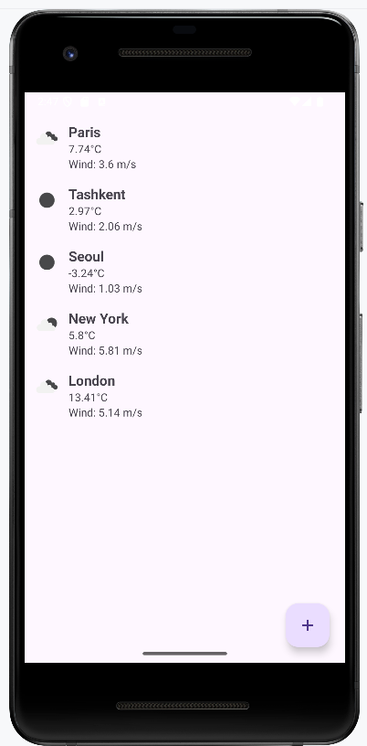

# WeatherApp

This is the very basic WeatherApp that makes use of API Key generated from https://openweathermap.org. So, if you want to run this app, please generate API Key from the website and replace it in WeatherService.java file.

